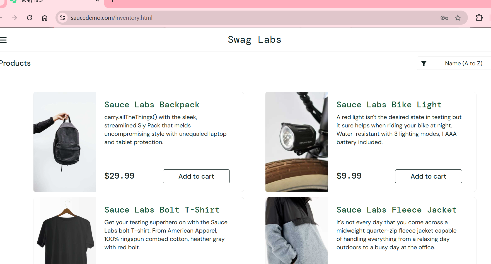

# Test Cases – Login

| ID   | Test Case              | Steps                                                                                      | Expected Result                                         | Screenshot |
|------|-----------------------|--------------------------------------------------------------------------------------------|--------------------------------------------------------|------------|
| TC01 | Successful login       | 1. Open the demo website   2. Enter username: `standard_user`   3. Enter password: `secret_sauce`   4. Click "Login" | User is logged in and sees the products page          |  |
| TC02 | Unsuccessful login     | 1. Open the demo website   2. Enter username: `locked_out_user`   3. Enter password: `secret_sauce`   4. Click "Login" | Error message displayed: "Sorry, this user has been locked out." |  |
