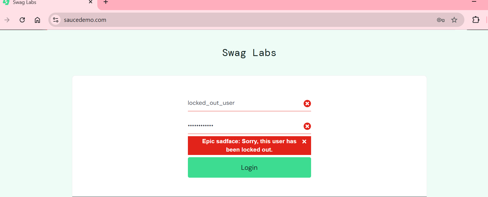
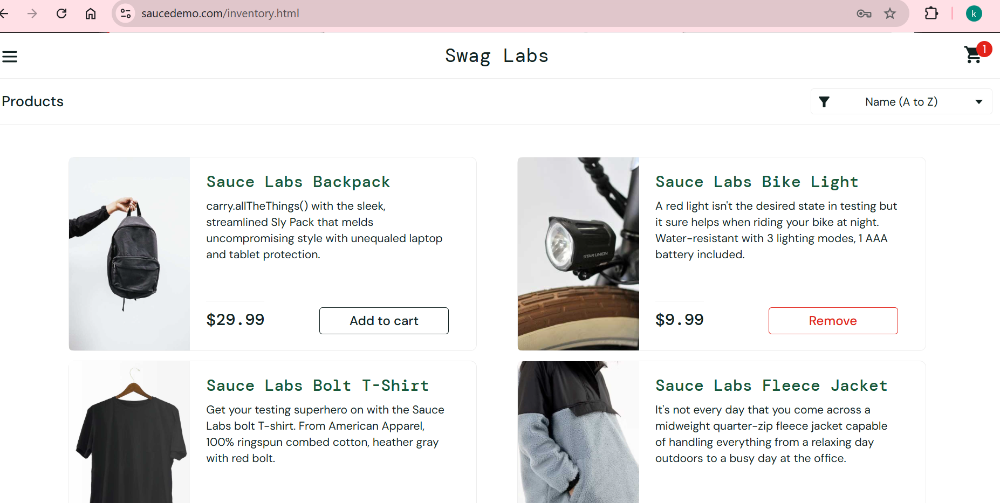

# Test Execution Report – SauceDemo

## Test Environment
- Browser: Chrome  
- OS: Windows 11  
- Date: March 2026  

## Tested Features
- Login
- Product list
- Add to cart
- Checkout

## Test Results

| Test Case                   | Result |
|------------------------------|--------|
| Login with valid user        | Passed |
| Login with invalid user      | Failed |
| Add product to cart          | Passed |
| Checkout process             | Passed |

## Bugs Found

| Bug Description                           | Screenshot |
|-------------------------------------------|------------|
| Login error message not displayed correctly |  |
| Cart icon does not update immediately after adding product |  |

## Summary
- Total tests: 4  
- Passed: 3  
- Failed: 1  
